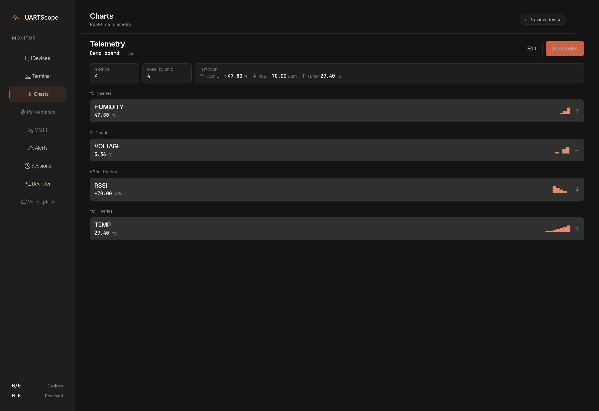

# UARTScope Pro

**Open-source embedded telemetry, debugging, and protocol analysis — the Wireshark of microcontrollers.**


UARTScope connects to a serial port, parses the telemetry your board emits
(`KEY:VALUE` lines and JSON), charts it live, alerts you on thresholds, records
replayable sessions, and decodes raw bus traffic (UART text, Modbus RTU, I2C,
SPI, CAN, CAN with a DBC file). The desktop app is pure Python (NiceGUI) — no
Node.js, no build step, no browser install.



## What it does

| Area | Detail |
|---|---|
| Serial monitoring | Connect, disconnect, and send on any serial port; terminal view of the raw stream |
| Live telemetry | Automatic `KEY:VALUE` and JSON parsing into per-metric charts grouped by unit |
| Alerts | Rule-based conditions (`>`, `<`, `>=`, `<=`, `==`, range, rate-of-change) with per-rule cooldown and an alert history with acknowledgment |
| Sessions | Record, replay, diff against a golden baseline, and export JSON/CSV; share as `.uartscope` bundles from the desktop app |
| Protocol decoders | Six built-ins — UART Text, Modbus RTU, I2C, SPI, CAN Bus, CAN DBC — all with encode as well as decode |
| MQTT | Multi-broker profiles, pub/sub, message history (backend API is live; the MQTT screen is still on the v1 UI — see below) |
| REST + WebSocket API | FastAPI backend on :8080 with ~50 verified routes; see [API reference](docs/reference-api.md) |

### What to know before you trust the screenshots

- The **Marketplace** screen is a UI mock: the catalog is a hardcoded list with
  sample download counts and authors. It is not wired to any registry.
- Three screens — **Performance, MQTT, Marketplace** — still show a
  "Not yet v2" pill; they run the pre-v2 UI while the rest of the app was
  redesigned.
- There is **no baudrate auto-detection**. You set the baudrate; the app uses it.
- Sessions are **not** created automatically when you start streaming. You
  create a session when you want one recorded.
- `.uartscope` session bundles are exported **from the desktop app only** —
  there is no REST endpoint for them.

## Quick start (5 minutes)

```bash
git clone https://github.com/DawnofGenX/uartscope.git
cd uartscope
python3 -m venv .venv
source .venv/bin/activate        # Windows: .venv\Scripts\activate
pip install -r backend/requirements.txt
python desktop_app.py
```

Open **http://localhost:3000**. That is the whole app: `desktop_app.py` imports
the backend modules in-process and serves the UI itself. You do **not** need to
run uvicorn separately for local use.

No board handy? Simulate one in a second terminal:

```bash
python scripts/simulate_device.py /dev/ttyUSB0 115200 --virtual
```

```text
Virtual serial port: /dev/pts/5
Connect UARTScope to: /dev/pts/5
```

Add the printed `/dev/pts/…` port as a device in the UI, press **Start**, and
watch live charts. The [tutorial](docs/tutorial-first-capture.md) walks through
this end to end.

### Backend API only

```bash
cd backend
python -m uvicorn app.main:app --port 8080
curl http://127.0.0.1:8080/api/health
```

```json
{"status":"healthy","version":"2.0.1","devices":{"total":0,"connected":0,"streaming":0,"errors":0,"total_bytes_received":0,"total_packets":0},"active_sessions":0,"websocket_clients":0}
```

### Docker

```bash
docker compose up -d
```

Docker is the one case where the HTTP backend matters: the desktop container is
given `API_URL=http://backend:8080` and the browser talks to the FastAPI
service on :8080, while the UI is served on :3000.

## Documentation

| If you want to… | Read |
|---|---|
| Get your first capture working | [Tutorial: your first capture](docs/tutorial-first-capture.md) |
| Fix "my board isn't showing up" | [How to connect a board](docs/how-to-connect-a-board.md) |
| Get paged when a value crosses a limit | [How to set up alerts](docs/how-to-alerts.md) |
| Record, replay, and export sessions | [How to use sessions and export](docs/how-to-sessions-and-export.md) |
| Decode raw bus traffic | [How to decode protocols](docs/how-to-decode-protocols.md) |
| Look up endpoints, config, or protocols | Reference: [API](docs/reference-api.md) · [configuration](docs/reference-configuration.md) · [protocols](docs/reference-protocols.md) |
| Understand how it works | Explanation: [architecture](docs/explanation-architecture.md) · [screens](docs/explanation-screens.md) |

Full docs index: [docs/index.md](docs/index.md).

## Development

Python 3.11–3.13 (CI matrix). From the repo root, with a venv active:

```bash
.venv/bin/python -m pytest backend/tests/ -q    # 75 tests
python check_handler_order.py
python check_dict_keys.py
python smoke_pages.py --boot --wait 60          # renders every screen headless
```

Lint is `ruff check app/ --line-length=120 --select E9,F63,F7,F82` from
`backend/`, enforced in CI.

## License

MIT. See [LICENSE](LICENSE).
