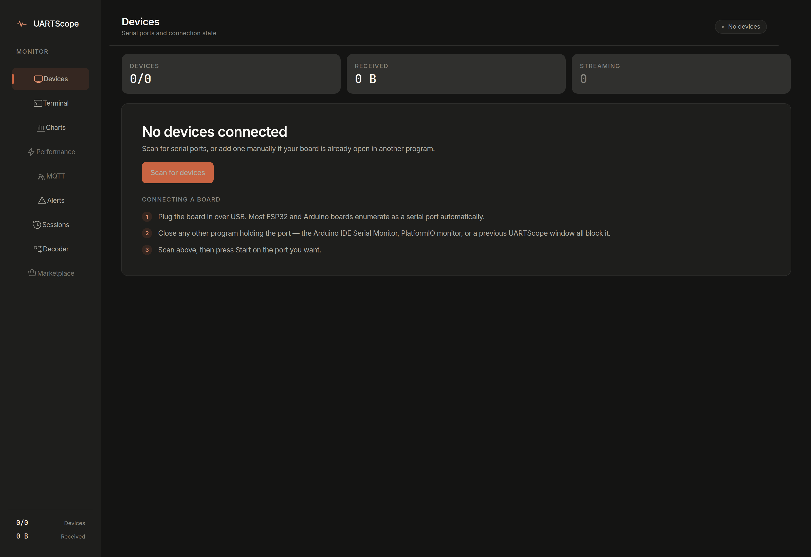
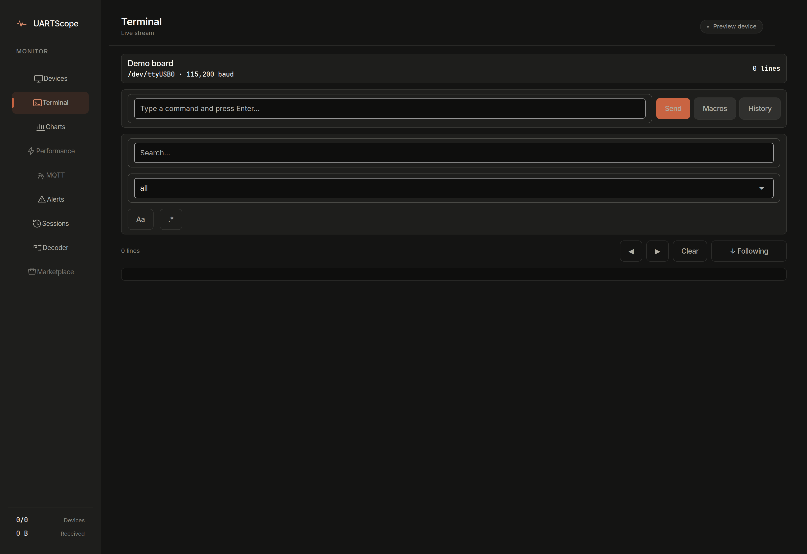
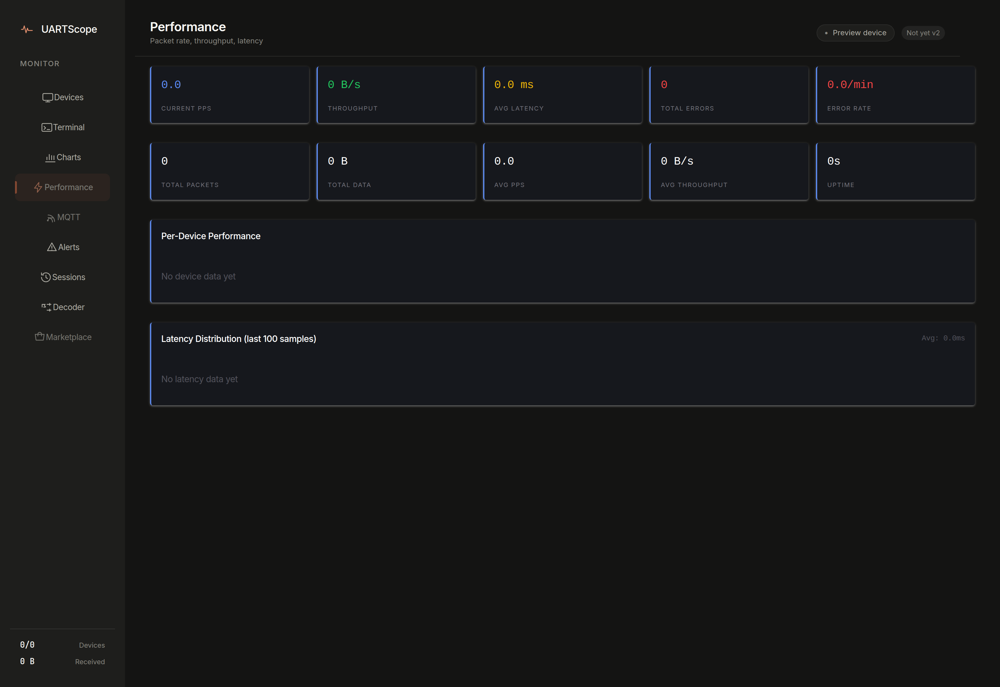
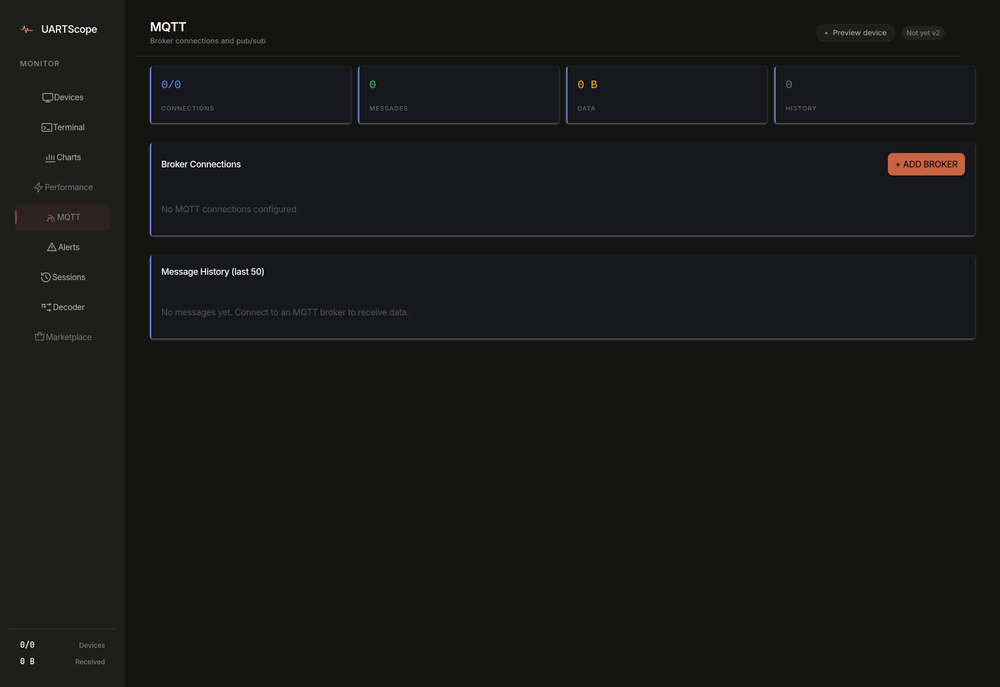
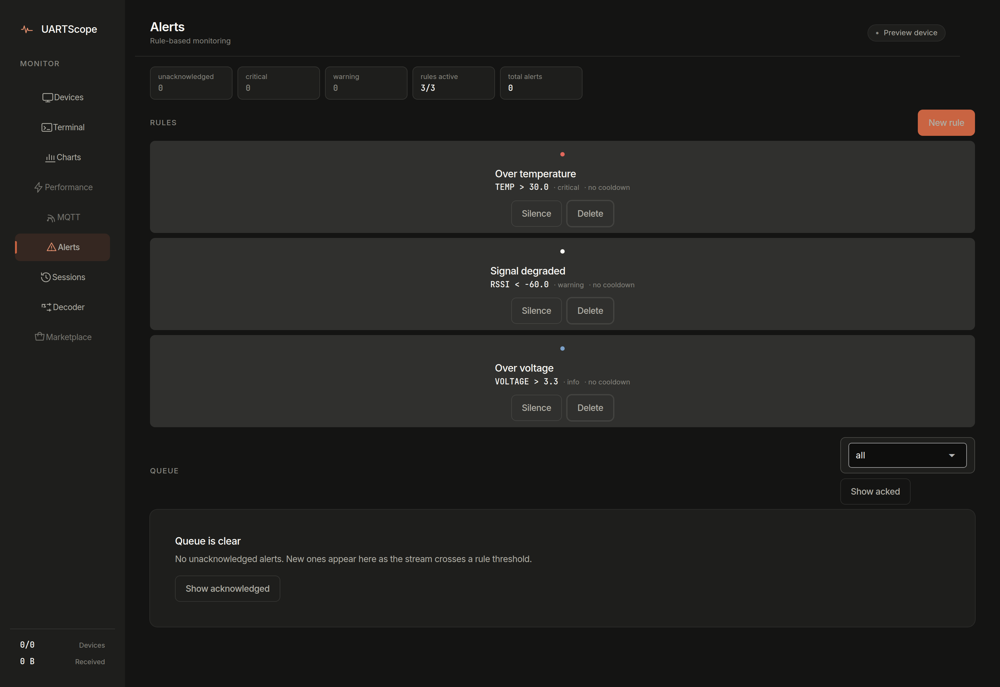
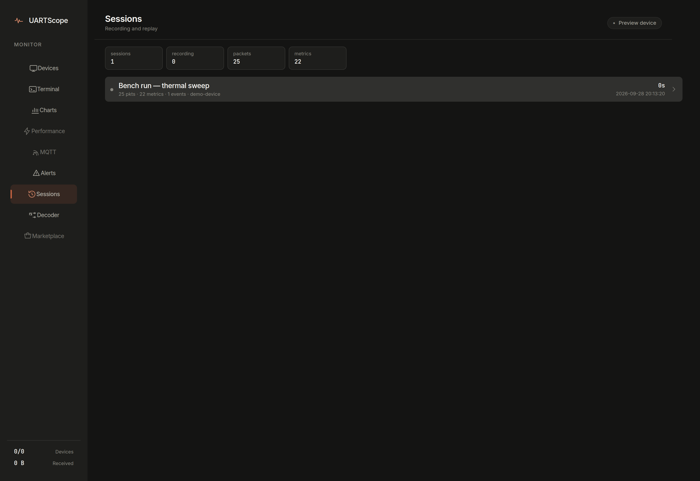
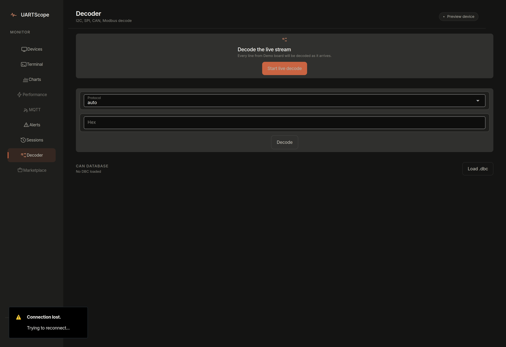
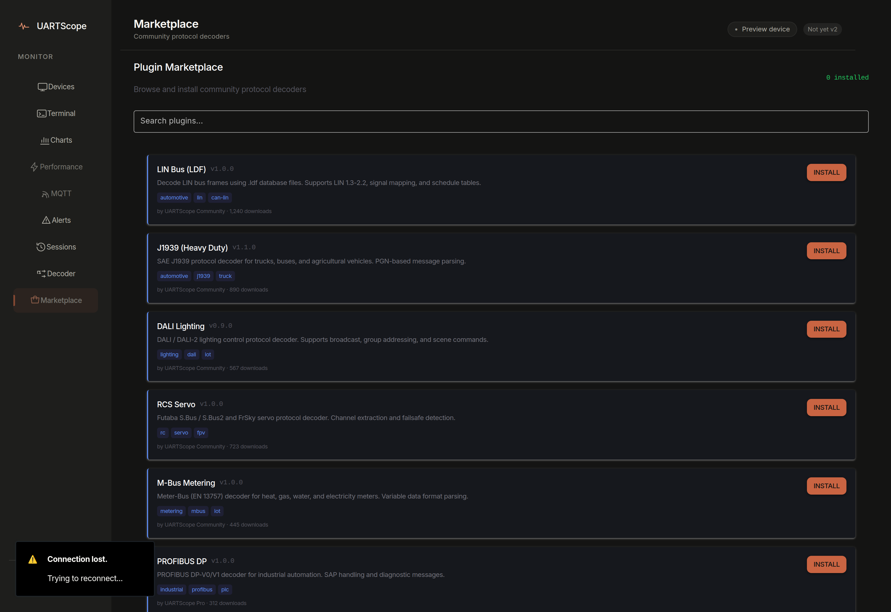

# The Nine Screens: What They Are For

A tour of UARTScope's screens — what each is good at and what it cannot tell
you. For why the app is shaped this way, see
[explanation-architecture.md](explanation-architecture.md); for the decoders
behind the Decoder screen, see [reference-protocols.md](reference-protocols.md).

One caveat up front, stated once: three screens — **Performance, MQTT, and
Marketplace** — are still on the v1 visual treatment and show a "Not yet v2"
pill in their header. Everything else in the navigation carries the v2
design. Screenshot paths are relative to `docs/` and show the dark theme.

The app seeds a demo device and a demo session at startup so every screen has
something to show, even with no hardware attached. The `01-devices-empty.png`
shot is the genuine first-run empty state; all other screenshots below show
the demo board bound and streaming. `sessions/` and `*.db` are gitignored —
the seeded data is runtime-only and never in the repository.

## Devices — the cockpit

**For:** discovering serial ports, registering boards, and starting/stopping
a link. Detection scans real ports; registration is where you choose port,
baudrate, and board type.

**Good at:** being the single place a device exists. Everything downstream —
Terminal, Charts, Alerts — subscribes to what you register here.

**Cannot tell you:** the right baudrate. There is no auto-baud detection;
pick wrong and the device connects but the bytes are noise. It also won't
identify an unknown board beyond the `board_type` metadata you set yourself.

## Terminal — the raw stream

**For:** reading exactly what the wire carries — debug prints, prompts,
REPLs — and typing back to the device.

**The follow-mode design, which you should know before trusting a scroll:**
the terminal follows the tail while you're at the bottom. The moment you
scroll up to read history, it **holds your position** — new lines do not
yank you around. An "N new lines" control appears so you can jump to the
fresh tail deliberately. This is deliberate: debugging is reading and
watching at the same time, and an always-jumping log is useless for the
first while you wait for the second.

**Cannot tell you:** what the bytes mean. That is the Decoder screen; the
Terminal shows raw traffic in arrival order.

## Charts — telemetry over time

**For:** trended metrics. Text telemetry that matches key/value shapes
(`TEMP:23.4`) is extracted into named metrics with units and plotted,
grouped by unit so temperature and voltage don't share a meaningless axis.

**Good at:** spotting drift, spikes, and resets over long captures; history
is capped per metric (`max_history_per_metric`, default 10 000 points).

**Cannot tell you:** about traffic it couldn't parse. Lines that don't yield
key/value metrics never appear here — check the Terminal or Decoder for
those.

## Performance — link health (Not yet v2)

**For:** bytes/sec, packets/sec, error counts, and latency — per device and
overall. Useful when a link is dropping or saturating.

**Cannot tell you:** *why* errors happen; it counts them, the log explains
them. Its counters are process-lifetime (in-memory), so a restart resets
them.

## MQTT — the broker bridge (Not yet v2)

**For:** mirroring telemetry to an MQTT broker and publishing commands back,
via connection profiles. Off by default
(`UARTSCOPE_MQTT_ENABLED=false`).

**Cannot tell you:** anything about a broker it can't reach — profiles are
local configuration, and the bridge is a relay, not a history.

## Alerts — threshold watch

**For:** rules over metrics ("TEMP above 30 °C") with severity levels,
per-rule cooldowns, and an acknowledgement queue.

**Good at since v2:** rules created here actually fire. The picker offers
symbol conditions (`>`, `<=`, `==`), and the engine aliases them to its
internal names — before the v2 fix, symbol-selected rules saved fine and
silently never matched. `range` needs a low and high bound; `change` fires on
jumps larger than the threshold.

**Cannot tell you:** about metrics that don't exist yet — a rule on a
misspelled metric name simply never matches. Cross-check names against the
Charts screen. See [how-to-alerts.md](how-to-alerts.md).

## Sessions — record, replay, share

**For:** capturing a run to disk and going back through it. A session holds
every packet, metric, and event between start and stop. Opening one gives
four sub-tabs: **Replay** (scrub the timeline), **Metrics** (the session's
series), **Export** (CSV/JSON, and the `.uartscope` shareable bundle), and
**Diff** (compare two captures). A session is only created when you ask —
streaming alone records nothing.

**Good at:** portability. Sessions are plain JSON files under `sessions/`,
and the `.uartscope` bundle is a zip of them — the detail screen above is
reconstructed entirely from files, no live device needed.

**Cannot tell you:** what happened after the stop button, and nothing about
a different device's link. Each session is bound to one run. Capture size is
capped (`max_session_size_mb`, default 500).

## Decoder — what the bytes mean

**For:** decoding a hex or ASCII payload against one of the six built-in
protocols, or letting autodetect choose and show its pick. Sample payloads
from `samples/payloads.json` are one click away.

**Good at:** known shapes — AT/NMEA/key-value text, Modbus function frames,
CAN frames with a loaded `.dbc`. Autodetect only claims a protocol above its
confidence floor; "no protocol detected" is a real, useful answer.

**Cannot tell you:** the meaning of arbitrary binary data, or CAN signals
without the matching DBC file. Decode-only where it says decode-only. See
[reference-protocols.md](reference-protocols.md).

## Marketplace — a catalog mock (Not yet v2)

**For:** showing what a decoder marketplace could look like. Be clear about
what you are looking at: the catalog is a hardcoded list in the UI, and the
download counts, authors, and ratings are fabricated sample data. No install
mechanism exists. Treat every number on this screen as decoration until this
page changes.

## Where to go next

- First capture end-to-end: [tutorial-first-capture.md](tutorial-first-capture.md)
- Wiring real hardware: [how-to-connect-a-board.md](how-to-connect-a-board.md)
- Exporting and sharing captures: [how-to-sessions-and-export.md](how-to-sessions-and-export.md)
