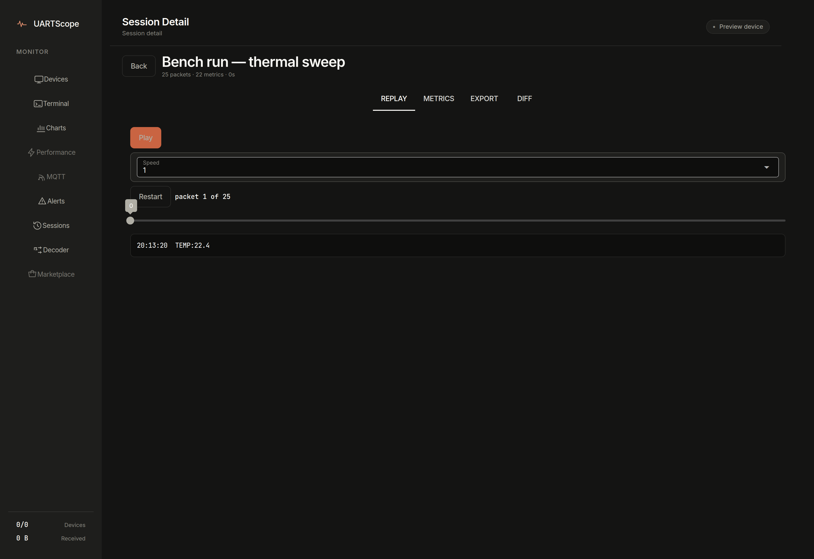

# Tutorial: your first capture

**Goal:** by the end of this lesson you will have UARTScope reading live
telemetry from a simulated board, charting it, and you will know how to do the
same with real hardware.

**Time:** about 15 minutes. **You need:** Python 3.11+, and either a board that
prints telemetry over USB serial (ESP32, Arduino, Pico, …) **or** no hardware at
all — the repo ships a device simulator.

## 1. Install and start the app

```bash
git clone https://github.com/DawnofGenX/uartscope.git
cd uartscope
python3 -m venv .venv
source .venv/bin/activate        # Windows: .venv\Scripts\activate
pip install -r backend/requirements.txt
python desktop_app.py
```

Open **http://localhost:3000**. You land on the **Devices** screen, which shows
`No devices connected` — correct, you have registered none yet.

Why this is all: `desktop_app.py` is the whole product. It imports the backend
modules directly and serves the UI on port 3000. You do not need to start a
separate API server for this lesson.

## 2. Make a device to talk to

If you have a board printing telemetry (a line like `TEMP:23.4,VOLTAGE:3.31`
once a second is perfect), plug it in and skip to step 3.

Otherwise, open a **second terminal** and run the simulator:

```bash
cd uartscope
.venv/bin/python scripts/simulate_device.py /dev/ttyUSB0 115200 --virtual
```

> Put `--virtual` **after** the port and baudrate arguments. The script reads
> its arguments positionally, so a flag placed first is treated as the port name.

The simulator creates a virtual serial port and prints its name:

```text
UARTScope Pro - Device Simulator
========================================
Simulating ESP32-style telemetry
Metrics: TEMP, VOLTAGE, HUMIDITY, PRESSURE
Press Ctrl+C to stop
========================================
Virtual serial port: /dev/pts/5
Connect UARTScope to: /dev/pts/5
```

A virtual port is a pair of linked pipes: anything written on one side comes out
the other, so UARTScope reads exactly what the simulator writes. Leave this
terminal running. Note the printed `/dev/pts/…` path — yours will differ.

If your board printed a **permission error** when you plugged it in, or the
simulator refused to open a port, see [Connect a board](how-to-connect-a-board.md)
for the Linux `dialout` / macOS / Windows fixes, then come back.

## 3. Register and connect the device

1. In the browser, click **Scan for devices**. UARTScope lists the serial ports
   it can see — your virtual port, or your board's `/dev/ttyUSB0` (Linux),
   `/dev/cu.usbserial-*` (macOS), or `COM3` (Windows).
2. Click **Add** on the port's row. This registers it as a device with baudrate
   115200, which is what both the simulator and most boards default to. There is
   **no baudrate auto-detection in UARTScope** — if your board uses a different
   speed, set the baudrate on the device row to match it.
3. Click **Start** on the device row. The button opens the serial link (it
   calls the backend's `connect` endpoint) and the status turns green.

The UI now reads the port, and the device screen counts bytes arriving. If the
status shows an error instead, the usual cause is another program (Arduino IDE,
a `minicom`/PuTTY window) holding the port — close it and reconnect.

## 4. Watch the data

Click **Terminal** in the left rail. Lines stream by:

```text
TEMP:24.1,VOLTAGE:3.28,HUMIDITY:53,PRESSURE:1013.4
```

UARTScope parses each `KEY:VALUE` pair into a metric as it arrives. Click
**Charts**: the metrics appear as live series, grouped by unit, scrolling as new
samples land.


Two things to notice:

- Nothing appears on Charts until the device is **Connected** and data is
  flowing. An empty chart is a broken path, not a broken parser — work back
  through steps 2–3.
- The simulator injects an occasional temperature spike every 100 samples;
  you can use it for the alerting exercise below.

## 5. Set your first alert

Alert rules watch a metric and fire when it crosses a threshold.

1. Click **Alerts**, then **New alert rule**.
2. Set name `temp spike`, metric `TEMP`, condition `>`, threshold `28`,
   severity `warning`, cooldown `5` seconds. Save.
3. Wait for the simulator's periodic spike. When `TEMP` exceeds 28, an entry
   appears in the alert history with the offending value. Click
   **Acknowledge** to clear it.

The cooldown is why a single spike produces one alert, not one per sample:
after firing, a rule waits out its cooldown before it can fire again. The
[alerts how-to](how-to-alerts.md) covers the other conditions and the history
API.

## 6. Record a session and replay it

Streaming data is not recorded until you ask — this is deliberate, so a long
monitoring session does not silently fill your disk.

1. Click **Sessions** and create one (name it `first-capture`).
2. Let it run for a minute, then stop it.
3. Open the session. The four tabs are the point of recording:
   - **Replay** — step back through the captured samples.
   - **Metrics** — min/max/avg per metric over the session.
   - **Export** — download the session as JSON or CSV, or (desktop app) as a
     shareable `.uartscope` bundle.
   - **Diff** — compare against a golden session; see the
     [sessions how-to](how-to-sessions-and-export.md).



## You did it

You now have the loop that everything else in UARTScope builds on: a connected
device, parsed live telemetry, threshold alerts, and a recorded, replayable
session. From here:

- Real hardware instead of the simulator: [Connect a board](how-to-connect-a-board.md)
- Send raw bytes to the Decoder screen: [Decode protocols](how-to-decode-protocols.md)
- Automate all of this from CI: [API reference](reference-api.md)
